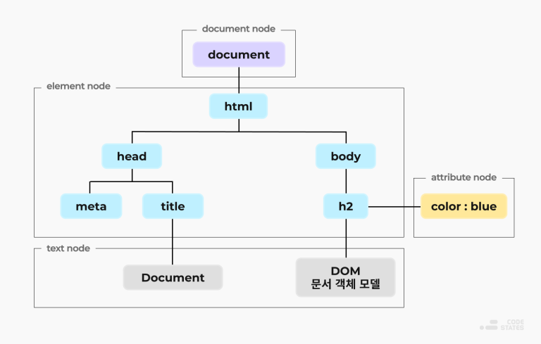

# React
## DOM (Document Object Model): 문서 객체 모델
- 텍스트 파일로 구성된 HTML, XML 문서들을 실행할 수 있는 프로그램으로 바꿔주는 것
- 프로그래밍 언어가 해당 문서(HTML, XML 등)를 접근하고 조작할 수 있도록 해주는 일종의 API를 제공하는 인터페이스이다.
- 웹페이지를 **계층적 구조**로 표현하는 **객체** => 트리 구조
- 어떤 프로그래밍 언어에 의존하지 않는 **독립적인 인터페이스**
### DOM 트리 구조
- HTML 파일을 트리 구조로 표현

#### document node (문서 노드)
- DOM Tree 구조에서 **최상위 루트 노드**
- HTML 문서 전체를 나타내는 노드
- HTML 문서에 오직 1개의 문서노드만 존재
#### element node (요소 노드)
- HTML 요소에 해당되는 노드
- 속성 노드를 가질 수 있는 유일한 노드
- **부모-자식 관의 관계 형성(계층 구조)**
#### attribute node (속성 노드)
- 모든 HTML 요소의 속성
- 요소 노드에 대한 정보를 가지고 있음
#### text node (텍스트 노드)
- HTML 문서의 모든 텍스트
- 계층 구조의 가장 하단 부분에 있음
### DOM의 정적 생성과 동적 생성
#### 정적 생성
- HTML 문서의 태그로만 작성
#### 동적 생성
- JS를 이용하여 HTML에 없는 노드를 만들어 웹페이지를 랜더링 하는 과정
- JS를 이용하여 있는 노드에 없는 노드를 이어 붙이는 것
## vanilla JS의 단점
- 웹페이지를 업데이트 할 때 DOM 노드를 하나 하나 수정 해야 한다. ==> 비효율 적임
- DOM을 조작하기에 코드가 복잡해짐 ==> 유지보수가 힘듦
## React란 무엇인가?
- 리엑트는 자바스크립트 UI 라이브러리이다.
- 상태값이 변경되면 UI를 자동으로 업데이트해주는 **JS라이브러리**
- 가상 DOM을 통해 변경된 부분만 효율적으로 업데이트
### React가 웹을 랜더링 하는 과정
  1. 도메인 주소로 접속 (https://이름.com)
  2. DNS(DomainNameServer)로 IP주소를 요청
  3. 서버가 클라이언트에게 해당 웹페이지를 전송
      - index.html App.js를 보냄
      - React는 SPA(Single Page Application)으로 index.html 단 하나만 존재
   - SPA (Single Page Application)
     - index.html 파일 하나만 가지고 랜더링
     - 번들러가 이를 해결 해줌
   - 번들러 (webpack)
     - 웹 어플리케이션을 동작시키기 위한 자원들을 **하나로 묶어 정적인 결과물** 생성
     - 서버에 가는 부담을 덜어줌
     - 웹페이지의 로딩 시간을 높여줌
  4. 서버로 부터 받아온 파일들로 Render Tree를 구성 => 실제 화면에 랜더링
### React Virtual DOM
- React에서 화면이 변하는 값들 state, props
#### React에서 리 랜더링 되는 경우
- Props가 변경됨
- State가 변경됨
- forceUpdate()를 실행
- 부모 컴포넌트가 랜더링 되었을 때
#### React에서 랜더링 되는 과정

1. 상태나속성이 변경되는 경우 React 가상의 돔을 그림
2. Virtual DOM과 Real DOM을 비교
3. 변경된 내용만 반영하여 새로운 화면을 랜더링 함